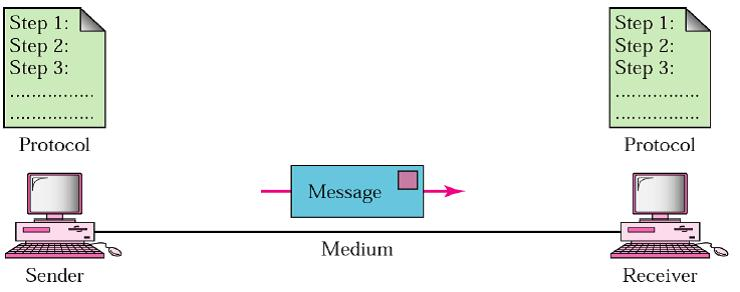

# Data Communications

#### **DATA COMMUNICATIONS:** 

Data Communication is a process of exchanging data or information In case of computer networks this exchange is done between two devices over a transmission medium. This process involves a communication system which is made up of hardware and software.

Data communication between different devices are broadly categorized into 3 types: Simplex communication, Half- duplex communication, and Full-duplex communication. 11.4.1 Simplex Communication. It is a one way or unidirectional communication between two devices in which one device is sender and other one is receiver

#### **COMPONENTS IN DATA COMMUNICATION :** 

#### **There are five components in data communication** 

* **Message**
* **Sender**
* **Receiver**
* **Transmission medium**
* **Protocol**

#### **DATA REPRESENTATION :** 

Data Refers to the symbols that represent people, events, things, and ideas. Data can be a name, a number, the colors in a photograph, or the notes in a musical composition.

Data Representation Refers to the form in which data is stored, processed, and transmitted.

Devices such as smartphones, iPods, and computers store data in digital formats that can be handled by electronic circuitry

The 0s and 1s used to represent digital data are referred to as binary digits. From this term we get the word bitthat stands for binary digit.A bit is a 0 or 1 used in the digital representation of data.

#### **DATA FLOW :** 

Data flow is the flow of data between 2 points. The direction of the data flow can be separated into three categories Simplex. Half Duplex. Full Duplex.

.png>)

Filters.The path of data from source document to data entry to processing to final reports. Data changes format and sequence (within a file) as it moves from program to program. See data flow diagram and data flow programming.
