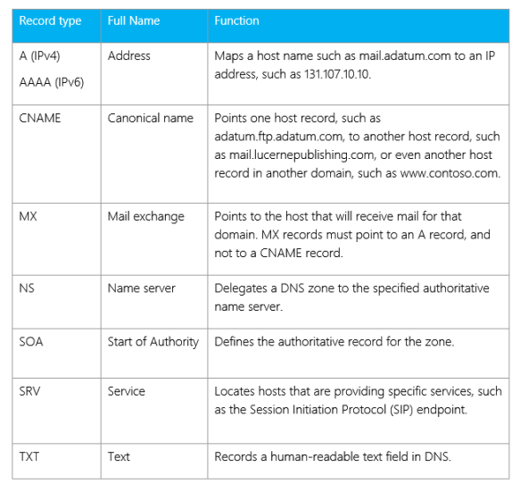
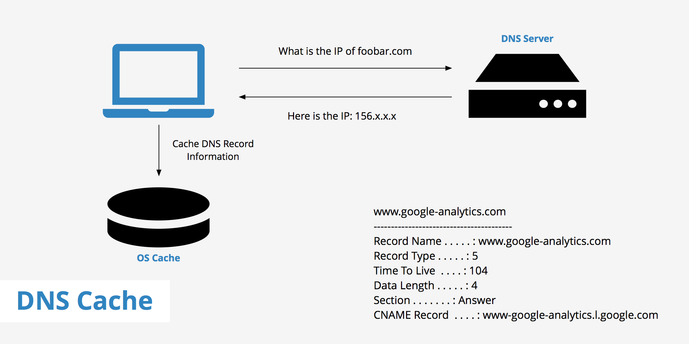

# DNS

**Introduction:**

Have you ever wondered how your computer magically connects to websites with just a few clicks? The answer lies in a fascinating technology called the Domain Name System (DNS). In this beginner-friendly blog post, we will explore what DNS is, how it works, and why it is essential for our everyday internet experience.

### See this video by IBM or Google and then read the theory part below





**1. What is DNS?**

\- DNS stands for Domain Name System. It is a hierarchical and distributed naming system that translates human-readable domain names (like www.example.com) into their corresponding IP addresses.

\- Think of DNS as the internet's phonebook, helping your device locate and connect to websites by translating easy-to-remember domain names into unique IP addresses.

<figure><figcaption></figcaption></figure>

**2. How Does DNS Work?**

\- When you type a website address in your browser, your device sends a DNS query to a DNS resolver (usually provided by your internet service provider or a third-party DNS provider).

\- The DNS resolver then begins the process of resolving the domain name to its corresponding IP address.

\- The resolver first checks its local cache to see if it already has the IP address for the domain. If not, it contacts other DNS servers in a hierarchical manner to find the information.

\- Once the IP address is obtained, it is returned to your device, allowing it to establish a connection with the requested website.

<figure><figcaption></figcaption></figure>

**3. The Importance of DNS:**

\- DNS plays a crucial role in the functioning of the internet and our everyday browsing experience.

\- It eliminates the need for us to remember and enter complex IP addresses by translating domain names into IP addresses that computers can understand.

\- DNS enables efficient web browsing by reducing the time it takes to locate and connect to websites, making the internet more user-friendly.

**4. DNS Record Types:**

\- DNS not only translates domain names to IP addresses but also stores various types of information in DNS records.

\- Some common DNS record types include:

\- A Record: Maps a domain name to an IPv4 address.

\- AAAA Record: Maps a domain name to an IPv6 address.

\- CNAME Record: Creates an alias for a domain name (used for subdomains or domain redirection).

\- MX Record: Specifies the mail server responsible for accepting email for a domain.

\- NS Record: Indicates the authoritative DNS server for a domain.

<figure><figcaption></figcaption></figure>

**5. DNS Caching:**

\- To improve DNS lookup speed and efficiency, DNS resolvers and devices implement caching.

\- When a DNS resolver receives a response for a DNS query, it stores the information in its cache for a certain period.

\- This caching mechanism helps reduce the time required for subsequent DNS queries and reduces the load on DNS servers.

\---

<figure><figcaption></figcaption></figure>

**Conclusion:**

The Domain Name System (DNS) is the backbone of the internet, providing a crucial service that translates human-readable domain names into IP addresses. It enables us to browse the web effortlessly, eliminating the need to remember complex strings of numbers. Understanding DNS and its workings gives us insight into how the internet functions and the role it plays in our everyday online activities. So, the next time you effortlessly access a website, remember that behind the scenes, DNS is working its magic to connect you to the right destination.
