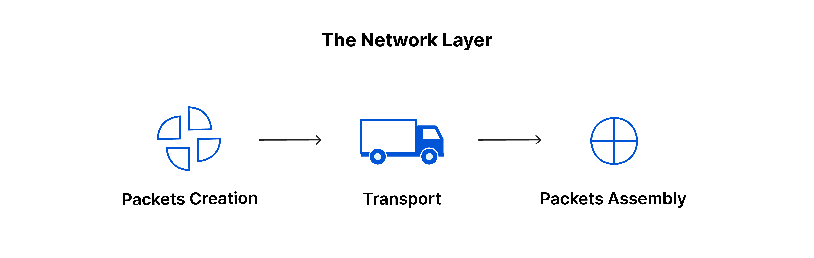

# Network Layer

#### **Layer 3: Network Layer - Efficient Routing and Packet Delivery**

The Network Layer, the third layer of the OSI model, focuses on the efficient transfer of data packets across different networks. It provides end-to-end packet delivery by determining the best path for data to travel from the source to the destination through various intermediate network devices. The Network Layer uses logical addresses to identify devices and employs routing protocols to make intelligent forwarding decisions.

#### **Key Concepts and Functions:**

<figure><figcaption></figcaption></figure>

#### **1. Logical Addressing:**&#x20;

The Network Layer uses logical addresses, such as IP (Internet Protocol) addresses, to uniquely identify devices on a network. These addresses are hierarchical and provide the necessary information for routing packets across different networks.

#### **2. Routing:**

&#x20;Routing is a key function of the Network Layer. It involves determining the optimal path for data packets to reach their destination. Routing protocols, such as RIP (Routing Information Protocol), OSPF (Open Shortest Path First), and BGP (Border Gateway Protocol), are used to exchange routing information between routers and make informed forwarding decisions based on factors like network topology, metrics, and policies.

#### **3. Packet Forwarding:**&#x20;

The Network Layer is responsible for forwarding packets from one network to another based on the destination IP address. Routers, which operate at this layer, examine the destination IP address of incoming packets and use routing tables to determine the appropriate next-hop router for forwarding.

#### **4. Fragmentation and Reassembly:**

&#x20;In cases where data packets are larger than the maximum transmission size supported by the underlying network, the Network Layer may perform fragmentation. It breaks large packets into smaller fragments for transmission and reassembles them at the destination.

<figure><figcaption></figcaption></figure>

#### **5. Quality of Service (QoS):**&#x20;

The Network Layer supports QoS mechanisms to prioritize certain types of traffic over others. QoS ensures that critical data, such as real-time voice or video, receives preferential treatment in terms of bandwidth allocation, latency, and packet loss.

#### **6. Address Resolution:**&#x20;

The Network Layer may include protocols, such as Address Resolution Protocol (ARP), to resolve logical addresses (IP addresses) to their corresponding physical addresses (MAC addresses). This mapping allows for the proper delivery of packets within the local network.

#### **7. Network Address Translation (NAT):**

&#x20;NAT is a Network Layer function that allows multiple devices within a private network to share a single public IP address. It translates private IP addresses to a public IP address when communicating with devices on the internet, enabling internet connectivity for private networks.

**Importance and Examples:**

The Network Layer plays a critical role in enabling efficient and scalable communication across different networks. It ensures that data packets are routed accurately, reaching their intended destinations in a timely manner. The Network Layer's functions are essential for facilitating global internet connectivity and enabling complex network architectures.

**Examples of technologies and protocols that operate at the Network Layer include:**

[**1. Internet Protocol (IP):** ](../ip-address/)

The most widely used protocol at the Network Layer, IP provides logical addressing and packet forwarding between different networks. IPv4 and IPv6 are the two versions of IP currently in use.

**2. Internet Control Message Protocol (ICMP):** ICMP is a Network Layer protocol that facilitates network diagnostics, error reporting, and Internet control functions. It is commonly used for tasks such as ping, traceroute, and error messaging.

**3. Routing Information Protocol (RIP):** RIP is a distance-vector routing protocol used to exchange routing information between routers in small to medium-sized networks. It calculates the best path to a destination based on the number of hops.

**4. Open Shortest Path First (OSPF):** OSPF is a link-state routing protocol used in larger networks. It uses a sophisticated algorithm to determine the shortest path to a destination based on factors like link bandwidth, latency, and congestion.

**5. Border Gateway Protocol (BGP):** BGP is an exterior gateway protocol used for routing between autonomous systems (ASes)on the internet. It allows routers in different ASes to exchange routing information and make informed routing decisions based on policies and preferences.

In conclusion, the Network Layer is responsible for efficient routing and packet delivery across networks. It uses logical addressing, routing protocols, and packet forwarding mechanisms to ensure that data reaches its intended destination. Understanding the concepts and protocols of the Network Layer is crucial for building scalable and well-connected networks.
