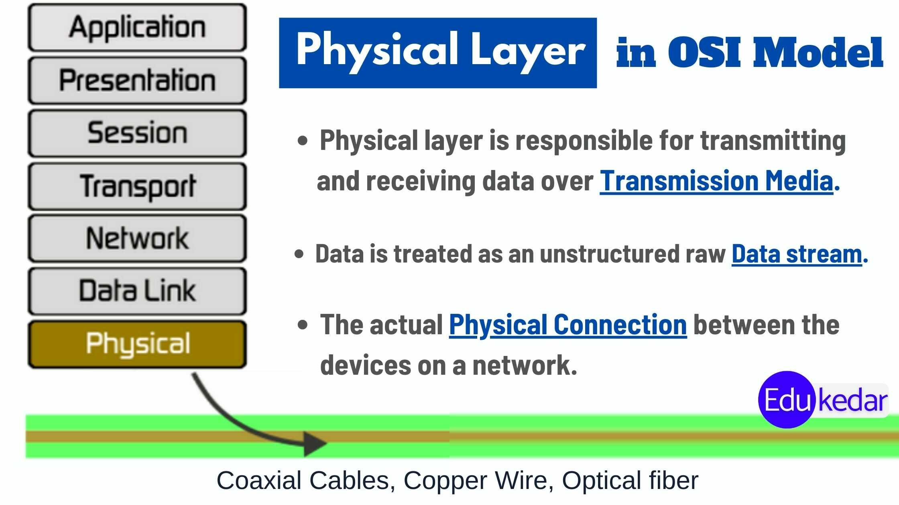

# Physical Layer

**Layer 1: Physical Layer - The Foundation of Network Communication**

The Physical Layer, the lowest layer of the OSI model, deals with the physical aspects of network communication. It focuses on the transmission of raw data bits over the physical medium, such as copper cables, fiber optics, or wireless signals. This layer defines the electrical, mechanical, and functional specifications necessary for devices to communicate effectively.

<figure><figcaption></figcaption></figure>

#### **Key Concepts and Functions:**

**1. Physical Media:** The Physical Layer specifies the types of physical media used for communication, such as twisted-pair copper cables, coaxial cables, fiber optic cables, or wireless transmission. Each medium has its own characteristics, including data transfer rates, signal propagation speed, and maximum distance.

**2. Connector Types:** The Physical Layer defines the types of connectors and interfaces required to connect devices to the physical media. Examples include RJ-45 connectors for Ethernet cables, BNC connectors for coaxial cables, and various types of connectors for fiber optic cables.

<figure><figcaption></figcaption></figure>

**3. Electrical Signaling:** It defines the voltage levels, signaling methods, and encoding schemes used to represent binary data on the physical medium. Common signaling techniques include amplitude modulation, frequency modulation, and phase modulation.

**4. Data Transmission Rates:** The Physical Layer determines the maximum data transfer rates supported by the physical medium. This rate is measured in bits per second (bps) and varies depending on the medium and its specifications. For example, Ethernet cables commonly support data rates of 10 Mbps, 100 Mbps, 1 Gbps, or higher.

**5. Synchronization:** To ensure accurate data transmission, the Physical Layer establishes synchronization between devices by defining clocking mechanisms. This synchronization allows devices to agree on the timing of data transmission and reception.

**6. Line Coding:** In many cases, the raw binary data bits need to be encoded into a specific format for transmission over the physical medium. Line coding techniques, such as Manchester encoding or Differential Manchester encoding, are used to convert binary data into a waveform that can be transmitted reliably.

**7. Error Detection:** The Physical Layer may include error detection mechanisms to identify transmission errors, such as noise or signal degradation. For example, parity bits or checksums can be added to data to verify its integrity.

**8. Physical Addressing:** Some technologies, like Ethernet, employ physical addressing to identify devices on a network. [Media Access Control (MAC) addresses](../mac-address.md), which are unique identifiers assigned to network interface cards, operate at this layer.

**9. Repeaters and Hubs:** Network devices such as repeaters or hubs operate at the Physical Layer. They regenerate and amplify signals to extend the reach of the network by connecting multiple segments of a network together.

**Importance and Examples:**

The Physical Layer plays a crucial role in establishing the physical connection between devices and enabling the transmission of data. It ensures that devices understand how to communicate over the chosen physical medium, such as copper cables or wireless signals. Without a properly functioning Physical Layer, reliable communication would be impossible.

**Examples of technologies and protocols that operate at the Physical Layer include:**

**1. Ethernet:** The most widely used technology for local area networks (LANs), Ethernet defines the physical and electrical characteristics of the network, such as the type of cable and connector used, as well as the data transfer rates.

**2. Wi-Fi:** Wireless networks, based on the IEEE 802.11 standard, utilize the Physical Layer to transmit and receive data over the air using radio waves. This layer governs the modulation schemes, channel frequencies, and other parameters necessary for wireless communication.

**3. Fiber Optics:** Fiber optic cables, made of glass or plastic fibers, transmit data using light signals. The Physical Layer of fiber optic communication involves the encoding and decoding of light signals and the characteristics of the optical connectors and cables.

**4. RS-232:** A widely used standard for serial communication, RS-232 defines the electrical signaling, connector types, and pin assignments for transmitting data between devices over serial ports.

In summary, the Physical Layer of the OSI model deals with the tangible aspects of network communication. It specifies the physical media, signaling methods, encoding schemes, and other parameters necessary for data transmission. By understanding the functions and concepts of this layer, network professionals can ensure reliable and efficient communication within computer networks.
