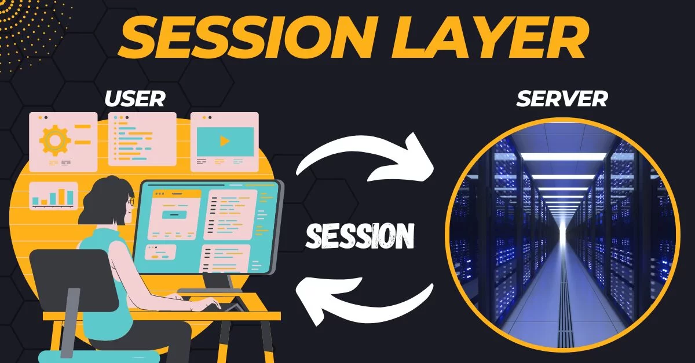
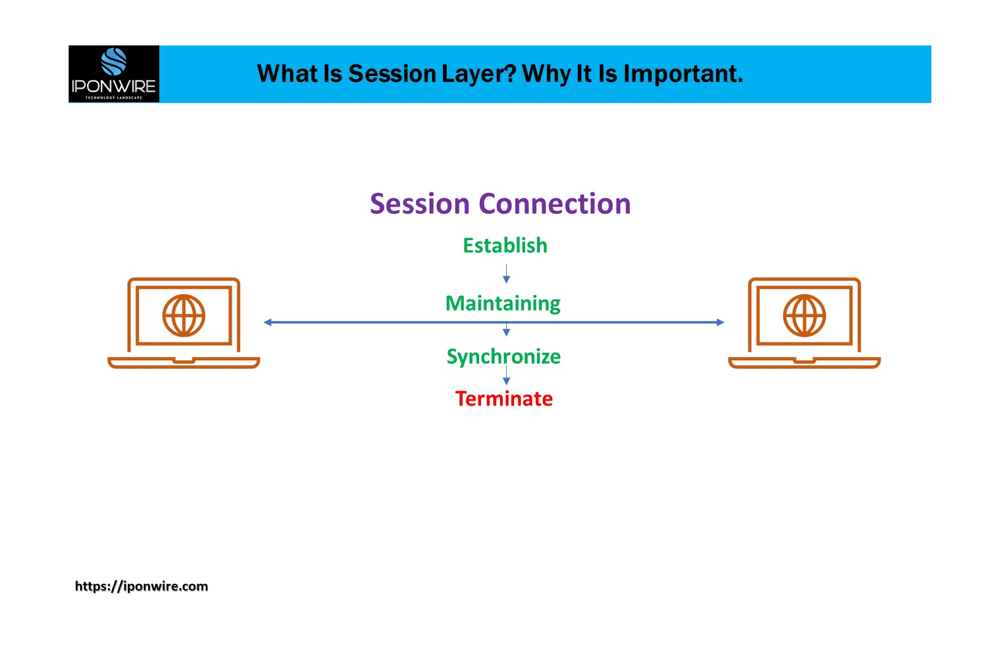

# Session Layer

<figure><figcaption></figcaption></figure>

**Layer 5: Session Layer - Establishing, Managing, and Terminating Communication Sessions**

The Session Layer, the fifth layer of the OSI model, is responsible for establishing, managing, and terminating communication sessions between applications running on different devices. It enables synchronization, coordination, and organization of data exchange, allowing applications to establish and maintain long-lived connections for efficient and reliable communication.

**Key Concepts and Functions:**

**1. Session Establishment and Termination:** The Session Layer facilitates the establishment and termination of sessions between applications. It provides mechanisms for session initiation, authentication, and negotiation of session parameters, ensuring that both ends of the communication are synchronized and ready for data exchange. Session termination involves properly closing the session and freeing any allocated resources.

**2. Session Management:** The Session Layer manages ongoing sessions by handling synchronization, checkpointing, and recovery mechanisms. It ensures that data is exchanged in an orderly manner, tracks the progress of the session, and manages potential interruptions or failures during the session.

**3. Dialog Control:** The Session Layer allows for full-duplex or half-duplex communication between applications by providing dialog control mechanisms. It coordinates the exchange of messages, ensuring that each application has an opportunity to transmit and receive data in an organized and controlled manner.

**4. Token Management:** In some cases, the Session Layer may manage token-based access to shared resources. It regulates access to resources by granting or releasing tokens, preventing conflicts and ensuring fair utilization of shared resources among multiple applications.

**5. Session Recovery:** The Session Layer includes mechanisms for recovering from session interruptions or failures. It enables the reestablishment of a session after a communication disruption, allowing applications to resume data exchange from the last known point of progress.

**6. Session Security:** The Session Layer may incorporate security mechanisms to protect the integrity and confidentiality of data exchanged during a session. It can establish secure connections using protocols like SSL/TLS (Secure Sockets Layer/Transport Layer Security) or implement session-level encryption and authentication.

<figure><figcaption></figcaption></figure>

**Importance and Examples:**

The Session Layer is responsible for managing and coordinating communication sessions between applications. It ensures that sessions are established, maintained, and terminated correctly, allowing applications to exchange data reliably and efficiently. The Session Layer's functions are crucial for applications that require long-lived connections, such as web browsing, file transfer, and video conferencing.

E**xamples of protocols and technologies that operate at the Session Layer include:**

**1. Remote Procedure Call (RPC):** RPC is a protocol that enables applications to invoke procedures or functions on remote systems. The Session Layer facilitates the establishment of RPC sessions, manages the exchange of RPC requests and responses, and ensures the orderly execution of remote procedures.

**2. NetBIOS (Network Basic Input/Output System):** NetBIOS is a session-layer protocol commonly used in legacy Windows networking environments. It provides services for session establishment, name resolution, and data transfer between applications.

**3. AppleTalk Session Protocol (ASP):** ASP is a session-layer protocol used in AppleTalk networks. It facilitates session establishment, synchronization, and management for applications running on Apple devices.

**4. Session Initiation Protocol (SIP):** SIP is a protocol used for initiating, modifying, and terminating multimedia sessions over IP networks. It operates at the Application Layer but incorporates session management functions that overlap with the Session Layer.

In summary, the Session Layer is responsible for establishing, managing, and terminating communication sessions between applications. It handles session establishment, synchronization, checkpointing, and recovery, ensuring efficient and reliable data exchange. Understanding the concepts and protocols of the Session Layer is essential for developing applications that require long-lived connections and coordinated data exchange.
