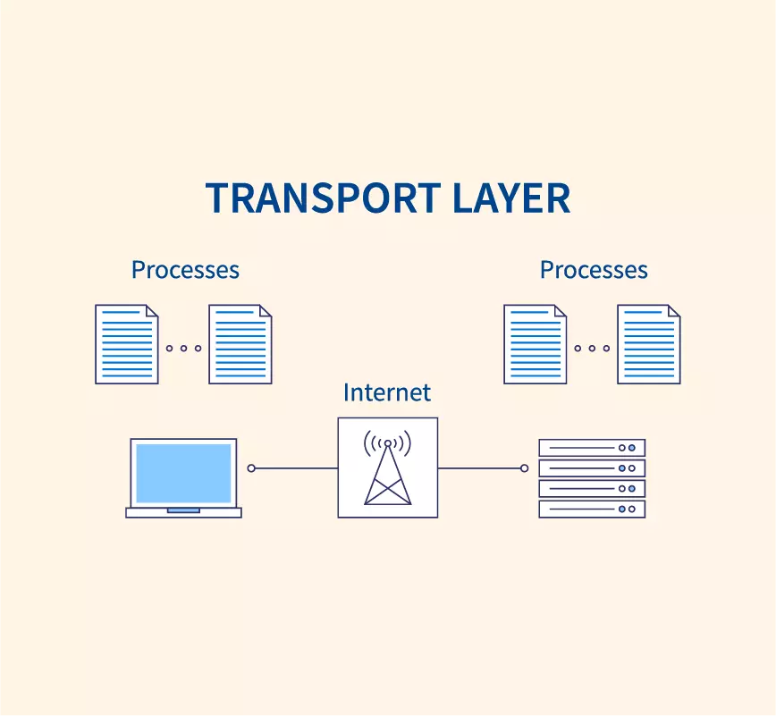
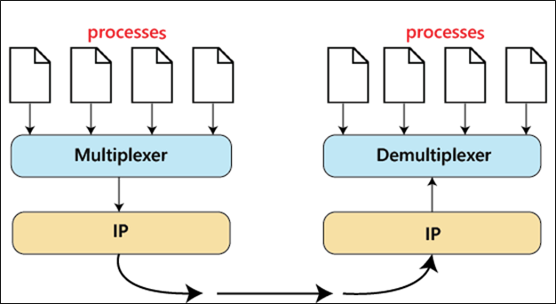
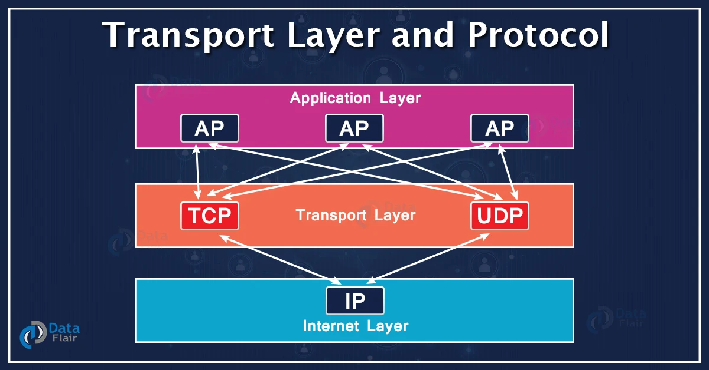

# Transport Layer

### **Layer 4: Transport Layer - Reliable Data Transfer and End-to-End Communication**

The Transport Layer, the fourth layer of the OSI model, provides reliable end-to-end communication between hosts or applications on different devices. It ensures that data is transmitted accurately, in the correct sequence, and with appropriate flow control mechanisms. The Transport Layer establishes connections, manages data segmentation and reassembly, and handles error recovery and congestion control.

<figure><figcaption></figcaption></figure>

**Key Concepts and Functions:**

**1. Segmentation and Reassembly:** The Transport Layer breaks large chunks of data received from the upper layers into smaller segments for transmission. At the receiving end, it reassembles these segments into the original data. Segmentation allows for efficient transmission and enables larger amounts of data to be sent across the network.

**2. Connection Establishment and Termination:** The Transport Layer provides mechanisms for establishing and terminating logical connections between communicating hosts. This ensures that data is transmitted reliably and that the receiving host is prepared to receive the incoming data.

**3. Connection-Oriented vs. Connectionless Communication:** The Transport Layer can operate in either connection-oriented or connectionless mode. Connection-oriented communication, as seen in protocols like TCP (Transmission Control Protocol), establishes a reliable and ordered connection before data transfer. Connectionless communication, as seen in protocols like UDP (User Datagram Protocol), does not establish a connection and provides a best-effort delivery service.

**4. Reliability and Error Recovery:** The Transport Layer ensures reliable data delivery by implementing error detection and recovery mechanisms. It uses sequence numbers, acknowledgments, and retransmissions to detect and recover from lost or corrupted packets. Protocols like TCP employ mechanisms like positive acknowledgments, selective retransmission, and sliding window flow control to guarantee reliable data transfer.

**5. Flow Control:** The Transport Layer manages the flow of data between communicating hosts to prevent the receiver from being overwhelmed with incoming data. Flow control mechanisms regulate the rate at which data is sent, ensuring that the receiver can handle and process the incoming data effectively. This prevents data loss, congestion, and potential network disruptions.

**6. Multiplexing and Demultiplexing:** The Transport Layer enables multiple applications or services to share the same network connection. It uses port numbers to multiplex and demultiplex data streams, ensuring that the appropriate data is delivered to the correct application or service on the receiving end.

<figure><figcaption></figcaption></figure>

**7. Quality of Service (QoS):** The Transport Layer may incorporate QoS mechanisms to prioritize specific types of traffic based on their requirements. QoS parameters include bandwidth allocation, latency, jitter control, and packet prioritization. This ensures that critical or real-time applications receive the necessary resources for optimal performance.

**Importance and Examples:**

The Transport Layer plays a crucial role in providing reliable end-to-end communication between applications or hosts. It ensures that data is transmitted accurately, regardless of the underlying network conditions. The Transport Layer's functions are essential for applications such as file transfer, web browsing, email delivery, and real-time multimedia streaming.

**Examples of protocols and technologies that operate at the Transport Layer include:**

**1. Transmission Control Protocol (TCP):** TCP is a connection-oriented protocol that provides reliable, ordered, and error-checked delivery of data. It guarantees the successful transmission of data between applications by establishing a connection, segmenting data, performing error recovery, and managing flow control.

**2. User Datagram Protocol (UDP):** UDP is a connectionless protocol that offers a best-effort delivery service. It does not establish a connection before data transfer and does not provide reliability or flow control. UDP is commonly used for applications where real-time or low-latency communication is crucial, such as streaming media or real-time gaming.

<figure><figcaption></figcaption></figure>

**3. Stream Control Transmission Protocol (SCTP):** SCTP is a transport protocol that combines the features of both TCP and UDP. It offers reliable and ordered delivery of data, like TCP,but also supports multi-homing and multi-streaming, providing additional flexibility and resilience.

**4. Multipurpose Internet Mail Extensions (MIME):** MIME is a standard that extends the capabilities of email to support multimedia attachments, such as images, audio, and video. It operates at the Transport Layer to encode and decode email messages with attachments.

**5. Real-time Transport Protocol (RTP):** RTP is a transport protocol designed for real-time multimedia streaming applications. It provides end-to-end delivery services for audio and video streams, including features like timestamping, sequencing, and payload type identification.

In summary, the Transport Layer ensures reliable data transfer and end-to-end communication between applications or hosts. It handles data segmentation, connection establishment, error recovery, flow control, and multiplexing. Understanding the concepts and protocols of the Transport Layer is vital for developing robust and efficient networked applications.
