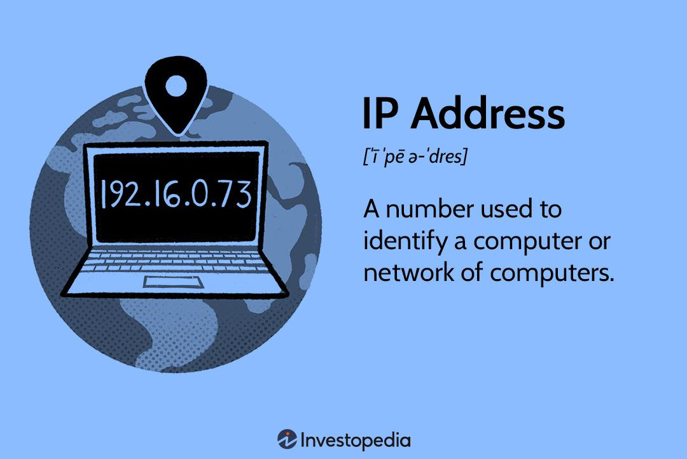

# IP address

<figure><figcaption></figcaption></figure>

**what is an IP ADDRESS ?**

* An IP address, short for Internet Protocol address, is a unique numerical identifier assigned to each device connected to a computer network. It serves two main purposes: identifying the host or network interface and providing the location of the device in the network.
* Think of an IP address as a virtual "home address" for devices on the internet. It allows data to be sent and received between devices by specifying the source and destination of the communication. IP addresses can be either **IPv4 (32-bit) or IPv6 (128-bit) format**.
* IP addresses are crucial for the functioning of the internet as they enable devices to communicate and exchange data. They play a vital role in routing internet traffic and facilitating connections between different devices, servers, and websites.
* By knowing your IP address, you can understand how devices are uniquely identified on the internet and how data is transmitted across networks.
