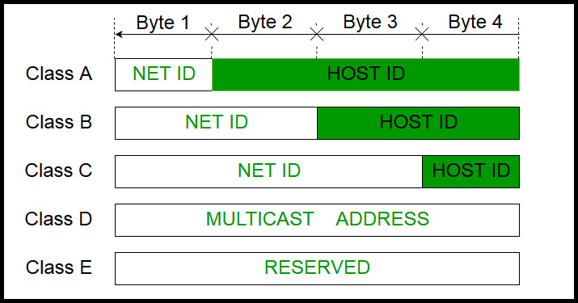

# Anatomy of IPv4 and IPV6&#x20;

**Introduction:**

In the vast world of computer networks and the internet, IP addressing is a fundamental concept. It enables devices to communicate with each other across networks. In this beginner-friendly blog post, we will explore the anatomy of IPv4 headers, the concept of IPv4 classes, how to convert IPv4 addresses from decimal to binary format, and provide an overview of IPv6 headers and classes.

**Part 1: IPv4 Addressing**

**1. Anatomy of IPv4 Headers:**

\- IPv4 headers contain essential information for transmitting data packets.

\- Key fields in the IPv4 header include version, header length, type of service, total length, identification, flags, fragment offset, time to live, protocol, header checksum, source IP address, and destination IP address.

\- Understanding the purpose of these fields helps ensure successful transmission and delivery of data packets.

<figure><figcaption></figcaption></figure>

**2. IPv4 Classes:**

\- IPv4 classes were a way of allocating IP addresses based on their network requirements.

\- There were five classes: A, B, C, D, and E.

\- Each class had a fixed range of IP addresses and a different number of network and host identifiers.

<table><thead><tr><th width="93">Class</th><th width="177">Range</th><th width="174">No. of Network IDs</th><th width="150">No. of Host IDs</th><th width="300">Used by</th></tr></thead><tbody><tr><td>Class A</td><td>1.0.0.0 to 127.255.255.255</td><td>1</td><td>3</td><td>Large networks, such as the Internet backbone</td></tr><tr><td>Class B</td><td>128.0.0.0 to 191.255.255.255</td><td>2</td><td>2</td><td>Medium-sized networks, such as corporate networks</td></tr><tr><td>Class C</td><td>192.0.0.0 to 223.255.255.255</td><td>3</td><td>1</td><td>Small networks, such as home networks</td></tr><tr><td>Class D</td><td>224.0.0.0 to 239.255.255.255</td><td>N/A</td><td>N/A</td><td>Multicasting</td></tr><tr><td>Class E</td><td>240.0.0.0 to 255.255.255.255</td><td>N/A</td><td>N/A</td><td>Reserved for future use</td></tr></tbody></table>

<figure><figcaption></figcaption></figure>

**3. Converting IPv4 Addresses from Decimal to Binary:**

\- IPv4 addresses are represented in decimal format, but they can be converted to binary for better understanding and manipulation.

\- The decimal number in each octet of the IP address is converted to an 8-bit binary number.

\- By converting each octet to binary and combining them, the binary representation of the IP address is obtained.

**Part 2: IPv6 Addressing**

**1. Anatomy of IPv6 Headers:**

\- IPv6 headers are structured differently from IPv4 headers and include key fields for packet handling.

\- Important fields in the IPv6 header include version, traffic class, flow label, payload length, next header, hop limit, source IP address, and destination IP address.

\- IPv6 headers provide improved efficiency, extensibility, and security compared to IPv4.

**2. IPv6 Classes:**

\- Unlike IPv4, IPv6 does not have traditional classes like A, B, or C.

\- IPv6 addresses are divided into different types, such as unicast, multicast, and anycast addresses, which serve specific purposes.

<table><thead><tr><th width="93">Class</th><th width="1129">Purpose</th></tr></thead><tbody><tr><td>Unicast</td><td>Identifies a single interface. Packets addressed to a unicast address are delivered to a specific network interface.</td></tr><tr><td>Anycast</td><td>Identifies a group of interfaces, usually belonging to different nodes. A packet sent to an anycast address is delivered to just one of the member interfaces, typically the nearest host, according to the routing protocol's definition of distance.</td></tr><tr><td>Multicast</td><td>Identifies a group of interfaces in such a way that a packet sent to a multicast address is delivered to all of the interfaces in the group.</td></tr></tbody></table>

<figure><figcaption></figcaption></figure>

**3. Converting IPv6 Addresses from Decimal to Binary:**

\- IPv6 addresses are expressed in hexadecimal format.

\- Each hexadecimal digit is equivalent to 4 bits of binary representation.

\- By converting each hexadecimal digit to its binary equivalent, the binary representation of the IPv6 address can be obtained.

**Conclusion:**

IP addressing is the backbone of modern networking, enabling devices to communicate and connect across the internet. In this blog post, we explored the anatomy of IPv4 headers, the concept of IPv4 classes, the conversion of IPv4 addresses from decimal to binary format, as well as provided an overview of IPv6 headers, classes, and the conversion of IPv6 addresses from decimal to binary format. Understanding these foundational aspects of IP addressing will help you grasp the fundamentals of networking and enhance your knowledge of the internet's infrastructure.
