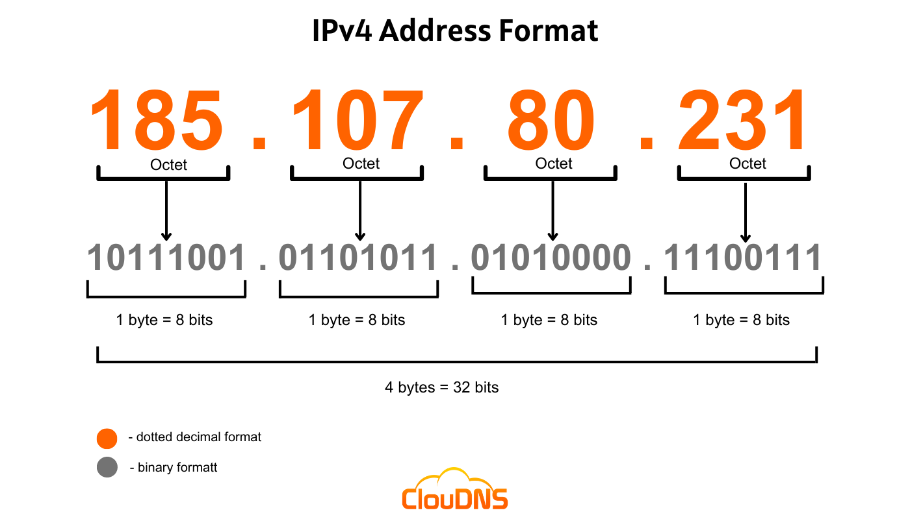
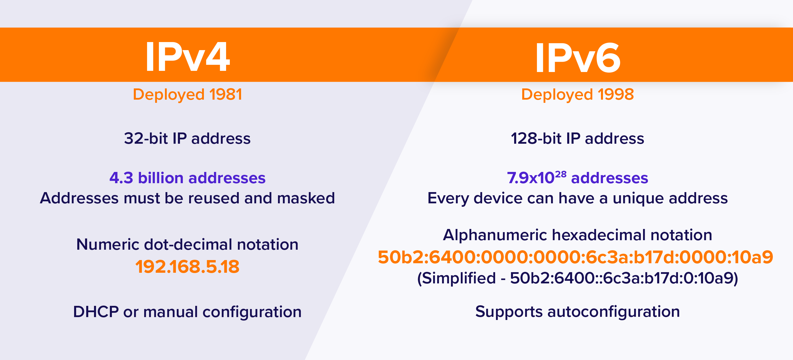

# IPV4 and IPV6

**IPv4 (Internet Protocol version 4) and IPv6 (Internet Protocol version 6)** are two different versions of the Internet Protocol, which is responsible for addressing and routing data packets on the internet. Here's a brief overview of IPv4 and IPv6:

**IPv4:**

\- IPv4 is the fourth version of the Internet Protocol and has been widely used since the early days of the internet.

\- It uses a 32-bit addressing system, allowing for approximately 4.3 billion unique IP addresses.

\- IPv4 addresses are written as four sets of numbers separated by periods (e.g., 192.168.0.1).

\- Due to the increasing number of internet-connected devices, the available pool of IPv4 addresses has been largely depleted, leading to the adoption of IPv6.

<figure><figcaption></figcaption></figure>

**IPv6:**

\- IPv6 is the most recent version of the Internet Protocol designed to replace IPv4.

\- It uses a 128-bit addressing system, allowing for an enormous number of unique IP addresses (approximately 340 undecillion).

\- IPv6 addresses are written as eight sets of four hexadecimal digits separated by colons (e.g., 2001:0db8:85a3:0000:0000:8a2e:0370:7334).

\- In addition to the increased address space, IPv6 offers improvements in network security, auto-configuration, and efficiency.

\- While IPv6 adoption is growing, it coexists with IPv4, and many networks and devices support both protocols through a mechanism called dual-stack.

<figure><figcaption></figcaption></figure>

In summary, IPv4 is the older version of the Internet Protocol and uses 32-bit addresses, while IPv6 is the newer version that uses 128-bit addresses. IPv6 provides a significantly larger address space to accommodate the growing number of internet-connected devices and offers several enhancements compared to IPv4. However, IPv4 is still widely used, and the transition to IPv6 is an ongoing process to ensure the continued growth and development of the internet.

<figure><figcaption></figcaption></figure>
