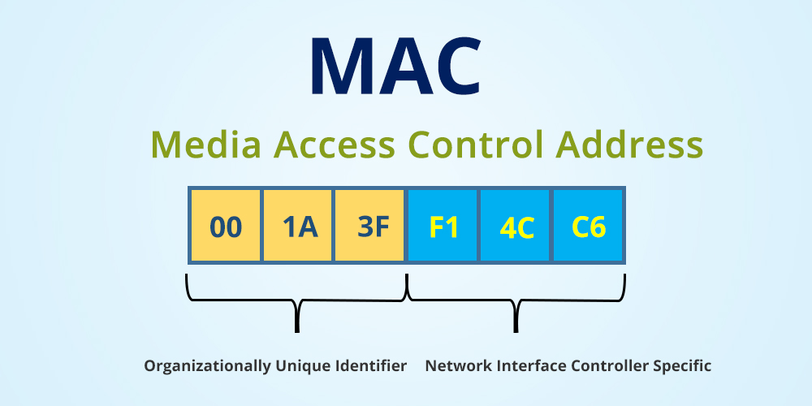

# MAC address

**Introduction:**

In the realm of computer networks, every network device is equipped with a unique identifier known as a MAC address. Understanding MAC addresses is essential for networking enthusiasts and professionals alike. In this beginner-friendly blog post, we will delve into the world of MAC addresses, exploring what they are, their format, and their significance in network communication.

<figure><figcaption></figcaption></figure>

**1. What is a MAC Address?**

\- MAC stands for Media Access Control, and a MAC address is a unique identifier assigned to a network interface card (NIC) of a device.

\- Unlike IP addresses that can change, MAC addresses are permanently assigned during manufacturing and are intended to be globally unique.

\- MAC addresses are assigned to both wired and wireless network interfaces, enabling devices to communicate with each other at the data link layer of the network protocol stack.

**2. MAC Address Format:**

\- A MAC address consists of 12 hexadecimal digits (0-9 and A-F) grouped into pairs separated by colons or hyphens.

\- Example: 00:1A:2B:3C:4D:5E

\- The first six digits (24 bits) represent the organizationally unique identifier (OUI), assigned by the Institute of Electrical and Electronics Engineers (IEEE) to the device manufacturer.

\- The remaining six digits (24 bits) represent the device's unique identifier within that manufacturer's allocation.

<figure><figcaption></figcaption></figure>

**3. Significance of MAC Addresses:**

\- MAC addresses play a vital role in local area network (LAN) communication.

\- They enable devices to identify and communicate directly with each other on the same network segment.

\- MAC addresses are used by Ethernet switches to forward data packets only to the intended recipient, enhancing network efficiency.

\- MAC addresses are not routable beyond the local network and are primarily used for communication within a LAN.

**4. MAC Address vs. IP Address:**

\- MAC addresses and IP addresses serve different purposes in networking.

\- While MAC addresses are unique identifiers tied to network hardware, IP addresses are used for higher-level network communication and routing.

\- MAC addresses operate at the data link layer, while IP addresses operate at the network layer.

\- MAC addresses are fixed and specific to a device, whereas IP addresses can be dynamically assigned and changed.

<figure><figcaption></figcaption></figure>

**Conclusion:**

MAC addresses are the unique identifiers assigned to network interface cards (NICs) of devices, allowing them to communicate with each other within a local area network. They play a crucial role in ensuring efficient data transmission and are permanent identifiers assigned during manufacturing. While IP addresses handle higher-level network communication, MAC addresses operate at the data link layer, enabling devices to communicate directly on the same network segment. Understanding MAC addresses and their significance is key to comprehending the intricacies of network communication and infrastructure.
