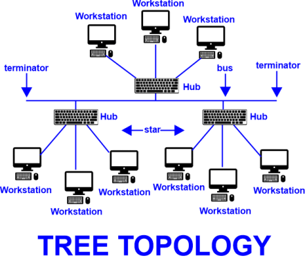

# tree topology

Tree topology is a network configuration that combines characteristics of bus and star topologies. It features a hierarchical structure with multiple levels of interconnected devices, resembling a tree. In a tree topology, devices are connected to a central node or root, forming branches that extend outwards.

**Connecting Nodes in Tree Topology:**

In a tree topology, devices are connected in a hierarchical manner. The central node serves as the root of the tree, and other devices branch out from it. Each device, except the root, is connected to a parent node, creating a parent-child relationship. Data transmission occurs through the hierarchy, flowing from parent nodes to child nodes.

<figure><figcaption></figcaption></figure>

### Video Resources


[Network Topologies Videos](http://localhost:5000/s/ZeJJu3qDetIU3qPmLSmZ/network-topologies-videos)


**Advantages of Tree Topology:**

**1. Scalability:** Tree topology supports scalability, allowing the addition of new devices or expansion of the network without affecting the entire structure. New devices can be connected to existing nodes or branches.

**2. Organized Structure:** The hierarchical structure of tree topology enables organized network management and easier troubleshooting. The parent-child relationships provide a clear overview of device connectivity.

**3. Segmentation and Efficiency**: Tree topology allows for segmentation of the network into different branches. This segmentation helps in optimizing network performance and improving data transmission efficiency within specific segments.

**4. Centralized Control:** The central root node provides centralized control and management of the network. It simplifies administration tasks, such as configuration, monitoring, and security management.

**Disadvantages of Tree Topology:**

**1. Dependency on Root Node:** The entire tree topology relies on the root node for network operation. If the root node fails, the entire network may become inaccessible or experience disruptions.

**2. Limited Scalability at the Root:** The scalability of tree topology can be limited by the capacity of the root node. If the root node cannot handle additional connections or traffic, it can hinder network expansion.

**3. Cost and Complexity:** Tree topology can require more cabling and networking equipment compared to other topologies, especially as the network grows. This can lead to increased installation and maintenance costs.

**4. Single Point of Failure:** Each level of the tree depends on its parent node. If a parent node fails, all its child nodes become disconnected from the network, potentially causing significant disruptions.

In summary, tree topology provides scalability, an organized structure, segmentation, and centralized control. However, it has disadvantages such as dependency on the root node, limited scalability at the root, cost and complexity, and the risk of a single point of failure. Understanding the advantages and disadvantages helps in evaluating the suitability of tree topology for specific network requirements.
