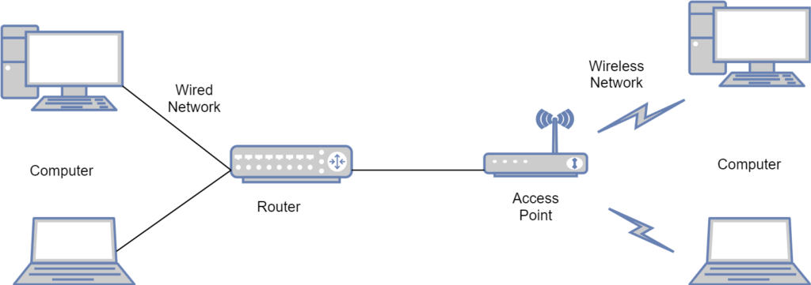

# Access Points and End points

**Access Points:**

An Access Point (AP) is a device that creates a wireless network by broadcasting a Wi-Fi signal. It serves as a central hub for connecting wireless devices to a wired network infrastructure. Access Points enable devices like smartphones, laptops, and tablets to connect to the network and access resources.

<figure><figcaption></figcaption></figure>

**Endpoints:**

Endpoints are devices connected to a network that initiate or consume network communications. They can be any device that accesses or utilizes network resources, such as computers, smartphones, printers, or IoT devices. Endpoints are typically the final destination or source of data within a network.

<figure><figcaption></figcaption></figure>

In summary, an Access Point is a device that creates a wireless network, allowing wireless devices to connect to a wired network infrastructure. Endpoints, on the other hand, are the devices that access or utilize network resources. Access Points serve as the central hub for wireless connectivity, while endpoints are the devices that connect to the network for communication and resource access.

### [Differences between Access Points and Endpoints](#user-content-fn-1)[^1]

| Access Points                                               | Endpoints                                                         |
| ----------------------------------------------------------- | ----------------------------------------------------------------- |
| Creates a wireless network by broadcasting a Wi-Fi signal   | Devices connected to the network that access or utilize resources |
| Serves as a central hub for wireless connectivity           | Act as the final destination or source of data within the network |
| Connects wireless devices to a wired network infrastructure | Initiates or consumes network communications                      |
| Provides wireless access to network resources               | Utilizes network resources for various purposes                   |
| Examples: Wi-Fi routers, wireless access points             | Examples: Computers, smartphones, printers, IoT devices           |
| Functions as a network infrastructure device                | Functions as the devices utilizing network resources              |

[^1]: 
