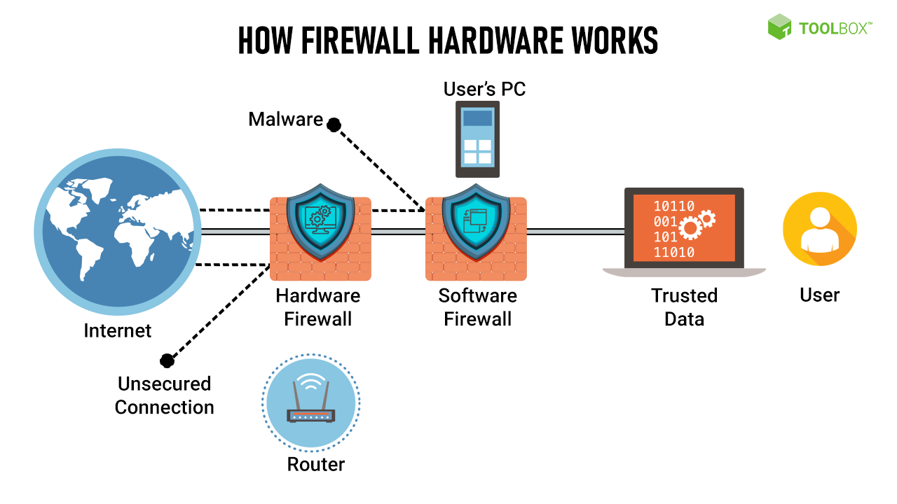
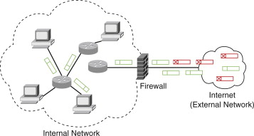

# Firewalls

A firewall is a network security device that acts as a barrier between an internal network and external networks, such as the internet. Its primary function is to monitor and control incoming and outgoing network traffic based on predefined security rules.

Firewalls are designed to protect a network from unauthorized access, malicious activities, and potential threats. They examine network packets, analyzing their source, destination, and content, and apply security policies to determine whether to allow or block the traffic.

The main purpose of a firewall is to enforce network security policies by implementing various security measures, such as:

<figure><figcaption></figcaption></figure>

**1. Packet Filtering:** Firewalls can inspect individual packets of data and compare them against a set of predefined rules. Based on these rules, packets can be allowed or denied access to the network.

**2. Stateful Inspection:** This technique tracks the state of network connections and only allows traffic that belongs to established and legitimate connections.

**3. Application-level Gateways (Proxy Firewalls):** These firewalls act as intermediaries between clients and servers, analyzing the application-layer traffic for specific protocols. They provide deep inspection of network traffic to identify and block potential threats.

**4. Network Address Translation (NAT):** Firewalls often include NAT functionality, which masks the internal IP addresses of devices, adding an extra layer of security by hiding the internal network structure.

<figure><figcaption></figcaption></figure>

Firewalls can be implemented as hardware appliances, software applications, or a combination of both. They are typically deployed at network entry points, such as the boundary between the internal network and the internet, to protect the entire network from external threats.

In summary, a firewall is a network security device that monitors and controls network traffic based on predefined rules. It acts as a barrier between internal and external networks, protecting against unauthorized access and malicious activities. Firewalls play a vital role in maintaining network security by enforcing security policies and preventing potential threats from compromising the network.
