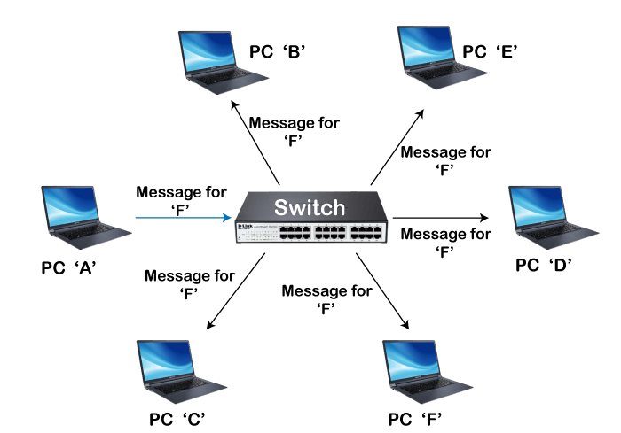

# Hubs and Switches

**Hubs:**

Hubs are basic network devices that serve as central connection points for devices within a local network. They operate at the physical layer of the network, where they receive data from one device and broadcast it to all other devices connected to the hub. However, hubs lack intelligence and do not examine the data packets they receive, leading to inefficient use of network bandwidth. As a result, collisions can occur when multiple devices try to transmit data simultaneously.

<figure><figcaption></figcaption></figure>

**Active Hub:**

* An active hub is a powered device that regenerates and amplifies incoming electrical signals before transmitting them to connected devices.
* It has multiple ports to connect devices, and it actively participates in signal regeneration and distribution.
* Active hubs are capable of extending the network's reach by amplifying signals, allowing devices to be connected over longer distances.
* However, they are considered less common today as they have been largely replaced by switches, which offer more advanced features and better performance.

<figure><figcaption></figcaption></figure>

**Passive Hub:**

* A passive hub, also known as a wiring hub, is an unpowered device that simply provides a physical connection point for devices.
* It does not amplify or regenerate signals; it simply broadcasts the received signal to all connected devices.
* As a result, the signal strength can degrade over longer cable lengths or when many devices are connected.
* Passive hubs are mainly used in legacy or smaller networks where signal degradation is not a significant concern, or when the network only requires basic connectivity.

<figure><figcaption></figcaption></figure>

### Video Resources :tada:


[Network Devices Videos](http://localhost:5000/s/ZeJJu3qDetIU3qPmLSmZ/video-resources/network-devices-videos)


**Switches:**

Switches, on the other hand, are more advanced network devices that operate at the data link layer of the network. Unlike hubs, switches have the ability to examine the data packets they receive and determine the destination device based on their Media Access Control (MAC) addresses. This enables switches to create dedicated pathways between devices, allowing for more efficient and secure communication within the network. By directing data only to the intended recipient, switches eliminate collisions and optimize network performance.

In summary, while hubs simply broadcast data to all connected devices, switches intelligently forward data packets only to the intended recipients. This makes switches more efficient in managing network traffic, reducing collisions, and improving overall network performance.

<figure><figcaption></figcaption></figure>

<figure><figcaption></figcaption></figure>

**Differences between Hubs and Switches**

|                     | **HUBS**                                                     | **SWITCHES**                                                     |
| ------------------- | ------------------------------------------------------------ | ---------------------------------------------------------------- |
| **Function**        | Broadcasts data to all connected devices                     | Directs data only to the intended recipient                      |
| **Operation**       | Operates at the physical layer of the network                | Operates at the data link layer of the network                   |
| **Intelligence**    | Lacks intelligence and does not examine data packets         | Examines data packets and determines the destination device      |
| **Performance**     | Prone to collisions and inefficient use of network bandwidth | Minimizes collisions and optimizes network performance           |
| **Security**        | Does not provide security features                           | Can implement security measures such as VLANs and access control |
| **Network Traffic** | Creates a shared collision domain                            | Creates separate collision domains for each device               |
| **Cost**            | Generally more affordable                                    | Can be more expensive due to added features and functionality    |
