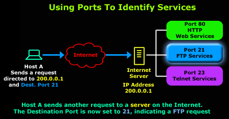
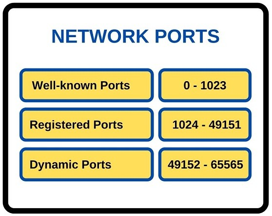
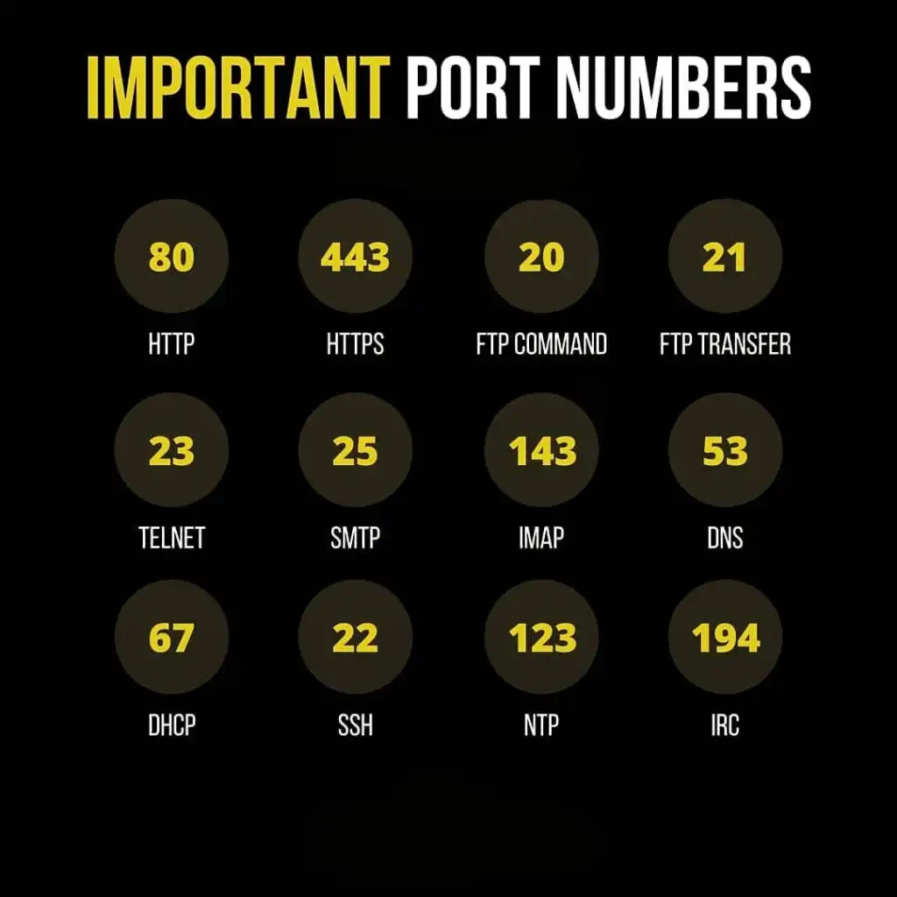

# Ports in Networking

## Introduction

In the vast world of computer networking, ports are the unsung heroes that facilitate seamless communication between applications and devices. In this beginner-friendly blog post, we will explore the significance of ports, their importance in networking, and delve into the realm of well-known or standardized ports. Get ready to unlock the doors to a deeper understanding of ports and their functions as we dive into each important port!

<figure><figcaption></figcaption></figure>

## 1. Understanding Ports in Computer Networking:

* Ports act as virtual endpoints that enable different applications and services to communicate with each other over a network.
* Think of ports as doors through which data enters and exits devices, ensuring it reaches the right destination.
* &#x20;Each port is identified by a unique number, known as a port number, which guides network traffic to the appropriate applications.

### 2. Importance of Ports:

* Ports play a pivotal role in enabling effective communication and data exchange in computer networks.
* They allow multiple applications to run simultaneously on a device, each utilizing a different port number.
* &#x20;By assigning specific port numbers, network devices can ensure that data reaches the intended applications accurately.

<figure><figcaption></figcaption></figure>

### 3. Real-Life Example: Ports at a Busy Airport:

* Let's visualize a bustling airport with multiple terminals and numerous gates. Each gate represents a port, and every departing or arriving flight symbolizes data traffic.
* The airport employs gate numbers to guide passengers to their respective flights. Similarly, ports utilize port numbers to direct data to the appropriate applications.

### 4. Unveiling the World of Well-Known or Standardized Ports:

* Among the **65,535 available ports**, certain port numbers are designated as well-known or standardized ports. These numbers are assigned to specific services for consistent use across networks.
* Let's categorize well-known ports into three sections: System Ports, User Ports, and Dynamic or Private Ports.

<figure><figcaption></figcaption></figure>

#### &#x20; a. System Ports (0-1023):

*   Reserved for essential services and protocols employed by the operating system.

    Examples:

    &#x20;       \- **Port 20 (FTP Data):** Facilitates file transfers over the File Transfer Protocol (FTP).

    &#x20;       \- **Port 80 (HTTP):** Enables web browsing and accessing websites using the Hypertext Transfer Protocol (HTTP)

#### b. User Ports (1024-49151):

*   Allocated to applications and services commonly used by users.

    Examples:

    &#x20;       **- Port 443 (HTTPS)**: Secures communication over the Hypertext Transfer Protocol Secure (HTTPS).

    &#x20;     **- Port 3389 (Remote Desktop Protocol):** Allows remote access to computers using the Remote Desktop Protocol.

<figure><figcaption></figcaption></figure>

#### c. Dynamic or Private Ports (49152-65535):

*   Reserved for temporary connections and dynamically assigned by applications.

    Examples:

    &#x20;       **- Port 50000 (UPnP):** Supports Universal Plug and Play (UPnP) services.

    &#x20;       **- Port 55000 (VNC):** Facilitates remote desktop access through Virtual Network Computing (VNC).

<figure><figcaption></figcaption></figure>

#### 5. Exploring Each Important Port:

* Now that we have a grasp of the well-known port categories, let's dive into each important port to understand its role and function in computer networking.
* In the upcoming sections, we will explore notable ports, their services, and the benefits they bring to our networked world\
