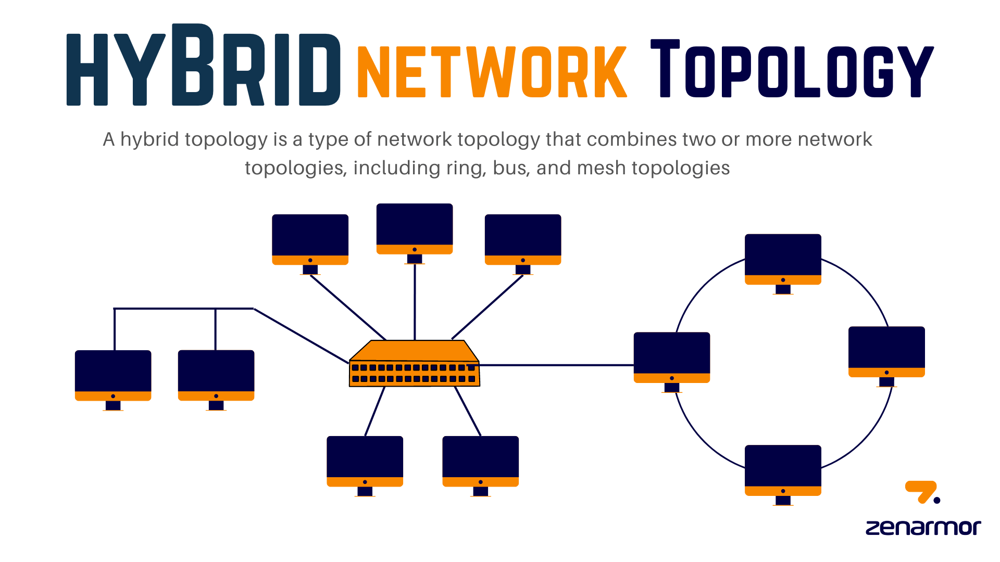

# Hybrid Topology

Hybrid topology is a network configuration that combines two or more different types of topologies into a single network. It is formed by interconnecting multiple smaller networks, each following a specific topology. By integrating different topologies, hybrid topology offers flexibility, scalability, and improved performance.

**Connecting Nodes in Hybrid Topology:**

In a hybrid topology, nodes are connected according to the specific topologies incorporated into the network. For example, a hybrid topology might include a combination of star, bus, and ring topologies. The different topologies are interconnected using bridges, switches, routers, or other networking devices to establish communication between the various networks.

<figure><figcaption></figcaption></figure>

**Advantages of Hybrid Topology:**

**1. Flexibility and Scalability:** Hybrid topology allows for flexibility in network design by combining different topologies. It offers scalability as individual networks can be expanded independently without affecting the entire hybrid network.

**2. Improved Performance:** By utilizing multiple topologies, hybrid topology can leverage the strengths of each topology to enhance overall network performance. For example, a star topology can provide centralized management and easy troubleshooting, while a mesh topology can offer redundancy and fault tolerance.

**3. Customization:** Hybrid topology enables customization based on specific network requirements. Different topologies can be chosen and integrated to meet the unique needs of different network segments or areas.

**4. Enhanced Reliability:** With the combination of multiple topologies, hybrid topology can provide increased reliability and fault tolerance. If one segment of the network fails, other segments can continue to function independently, minimizing network disruptions.

**Disadvantages of Hybrid Topology:**

**1. Complexity:** Hybrid topology can introduce complexity to the network design, implementation, and management. Integrating and maintaining multiple topologies requires additional expertise and careful planning.

**2. Cost:** The integration of different topologies in a hybrid network may involve additional hardware, cabling, and networking devices, leading to increased costs compared to a single topology.

**3. Management Challenges:** Managing a hybrid topology can be challenging due to the combination of different topologies. Troubleshooting and resolving issues may require specialized knowledge and skills.

**4. Potential Single Points of Failure:** Depending on the design and implementation, hybrid topology may still have single points of failure, especially at the points where different topologies are interconnected. A failure at such points can impact the entire network.

In summary, hybrid topology combines multiple topologies to provide flexibility, scalability, improved performance, customization, and enhanced reliability. However, it can introduce complexity, incur additional costs, present management challenges, and have potential single points of failure. Evaluating the advantages and disadvantages helps in determining the suitability of hybrid topology for specific network requirements.
