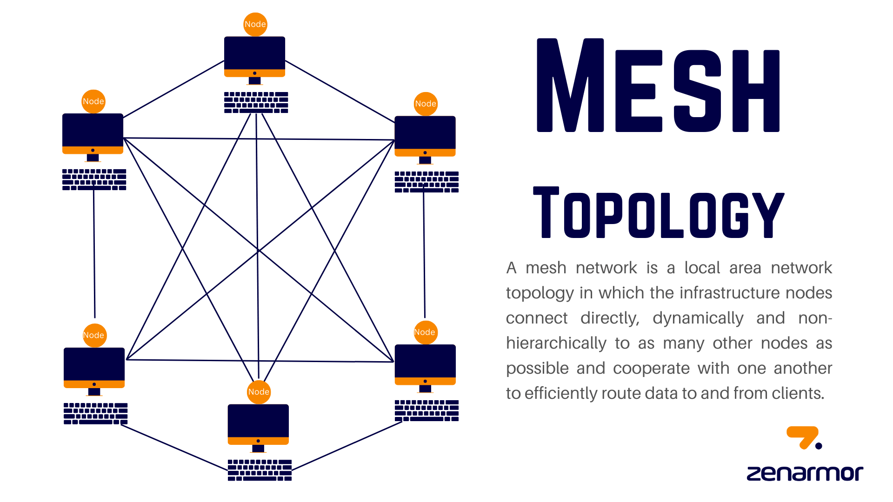

# Mesh Topology

Mesh topology is a network configuration where every device is connected to every other device in the network, forming a fully interconnected structure. Each device in a mesh network acts as a relay, providing multiple paths for data transmission. This extensive interconnectivity ensures redundancy and robustness in communication.

**Connecting Nodes in Mesh Topology:**

In a mesh topology, devices are interconnected in a point-to-point manner. Each device is directly connected to every other device in the network, creating multiple paths for data transmission. This can be achieved through physical connections like cables or wireless connections like Wi-Fi.

<figure><figcaption></figcaption></figure>

**Advantages of Mesh Topology:**

**1. Robust and Reliable:** Mesh topology offers high reliability and fault tolerance due to its redundant paths. If one path fails, data can automatically reroute through alternative paths, ensuring continuous communication.

**2. Scalability:** Mesh topology is highly scalable as new devices can be easily added without impacting the network's overall performance or connectivity.

**3. Improved Performance:** Mesh topology allows for parallel data transmission across multiple paths, resulting in increased network performance and reduced congestion.

**4. Enhanced Privacy and Security:** With every device connected directly to each other, mesh topology offers enhanced privacy and security as data doesn't pass through intermediate devices.

**Disadvantages of Mesh Topology:**

**1. Complexity and Cost:** Mesh topology can be complex to set up and manage due to the extensive interconnections. It requires more cabling and network resources, making it more expensive compared to other topologies.

**2. High Bandwidth Consumption:** In a fully meshed network, the extensive interconnectivity can lead to high bandwidth consumption. The need for maintaining numerous connections can strain network resources.

**3. Difficult Maintenance:** Troubleshooting and maintaining a mesh network can be challenging due to the large number of connections. Locating and isolating faults can be time-consuming.

**4. Inflexibility:** Modifying or reconfiguring a mesh network can be cumbersome, especially when adding or removing devices. Physical connections may need to be reestablished or modified.

In summary, mesh topology offers extensive interconnectivity, redundancy, and robustness in communication. It provides reliability, scalability, improved performance, and enhanced privacy and security. However, it comes with disadvantages such as complexity and cost, high bandwidth consumption, difficult maintenance, and inflexibility. Assessing the advantages and disadvantages helps in determining the suitability of mesh topology for specific network requirements.
