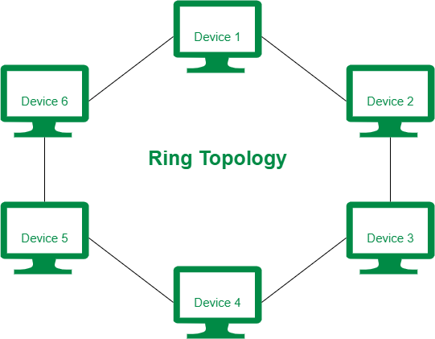

# Ring Toplogy

**Ring Topology:**

Ring topology is a network configuration where devices are connected in a closed loop or circular pathway, forming a ring-like structure. Each device in the network is connected to exactly two other devices, creating a continuous data transmission path. Data travels in only one direction around the ring, passing through each device until it reaches the intended recipient.

**Connecting Nodes in Ring Topology:**

In a ring topology, each device is connected to its adjacent devices, forming a circular chain. The last device in the chain is connected to the first device, completing the ring. Data transmission occurs sequentially, with each device receiving and forwarding the data to the next device in the ring.

<figure><figcaption></figcaption></figure>

**Advantages of Ring Topology:**

**1. Simplicity:** Ring topology is relatively simple to configure and implement.

**2. Efficiency:** Ring topology offers efficient data transmission as there is no contention for network access. Each device has dedicated time slots to transmit data.

**3. Equal Access:** Each device in the ring has equal access to the network, ensuring fair distribution of network resources.

**4. Balanced Network Load:** Data transmission is evenly distributed across all devices in the ring, preventing any single device from becoming a bottleneck.

**Disadvantages of Ring Topology:**

**1. Single Point of Failure:** If any device or the connection between devices fails, the entire network can be disrupted. The failure of a single device can break the ring, causing a network outage.

**2. Limited Scalability:** Expanding or adding devices to a ring topology can be challenging. The physical layout may need to be altered, and the network may require reconfiguration.

**3. Difficult Fault Isolation:** Troubleshooting and identifying faults in a ring topology can be complex. Locating the exact point of failure or network disruption can be time-consuming.

**4. Delay and Latency:** As data travels through each device in the ring, the overall latency of the network increases. The delay accumulates with each device in the transmission path.

In summary, ring topology is a network configuration where devices are connected in a closed loop. It offers simplicity, efficient data transmission, equal access, and balanced network load. However, it has limitations such as a single point of failure, limited scalability, difficulty in fault isolation, and increased delay and latency. Understanding the advantages and disadvantages of ring topology helps in assessing its suitability for specific network requirements.
