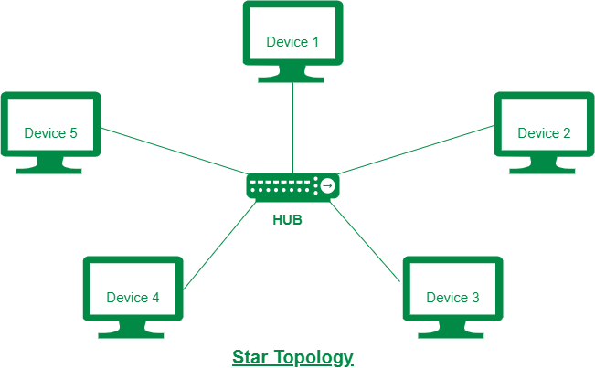

# Star Topology

Star topology is a network configuration where all devices are connected to a central hub or switch. The hub acts as a central point of communication, facilitating data transmission between devices. Each device in a star topology has a dedicated connection to the central hub, creating a spoke-like structure.

**Connecting Nodes in Star Topology:**

In a star topology, each device is connected individually to a central hub or switch using separate cables. The central hub serves as a connection point for all devices in the network. Data transmission occurs between devices by sending data from the source device to the central hub, which then forwards the data to the destination device.

<figure><figcaption></figcaption></figure>

**Advantages of Star Topology:**

**1. Centralized Management:** Star topology allows for centralized management and control. The central hub simplifies network monitoring, troubleshooting, and administration tasks.

**2. Easy Scalability:** Adding or removing devices in a star topology is simple and does not disrupt the entire network. New devices can be easily connected to the central hub without affecting other devices.

**3. Fault Isolation:** In star topology, if a device or connection fails, only that particular device is affected. The rest of the network remains operational, enhancing fault isolation and minimizing network downtime.

**4. Better Performance:** Each device has a dedicated connection to the central hub, ensuring efficient data transmission and reducing network congestion. This leads to improved network performance and reliability.

**Disadvantages of Star Topology:**

**1. Dependency on Central Hub:** The central hub is critical to the functioning of the star topology. If the hub fails, the entire network may become inaccessible. The reliance on a single point of failure can impact network availability.

**2. Cost:** Star topology may require more cabling compared to other topologies as each device requires a separate connection to the central hub. This can increase installation and maintenance costs.

**3. Limited Scalability:** The scalability of a star topology depends on the capacity of the central hub or switch. If the hub has limited ports, adding more devices may require upgrading the hub or using additional networking equipment.

**4. Point-to-Point Dependency:** In star topology, devices can only communicate through the central hub. If the hub experiences performance issues or becomes overloaded, it can affect the entire network's communication.

In summary, star topology provides centralized management, easy scalability, fault isolation, and better performance. However, it has disadvantages such as dependency on the central hub, potential cost implications, limited scalability based on hub capacity, and point-to-point communication dependency. Considering the advantages and disadvantages helps in evaluating the suitability of star topology for specific network requirements.
