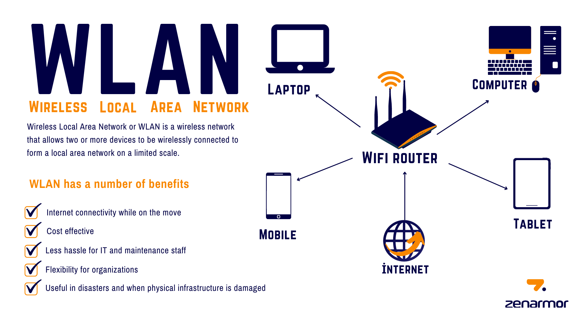

# LAN AND WLAN

**Introduction:**

In the world of computer networking, two commonly used terms are LAN and WLAN. These acronyms represent different types of networks that enable communication and data sharing among devices. In this blog post, we will delve into the basics of LAN (Local Area Network) and WLAN (Wireless Local Area Network) to help you grasp their key concepts and understand their significance in today's interconnected world.

**LAN (Local Area Network):**

A Local Area Network, or LAN, refers to a network infrastructure that connects computers, servers, printers, and other devices within a limited geographical area, such as a home, office building, or school campus. LANs are designed to facilitate resource sharing and data transfer among connected devices, enabling users to collaborate efficiently.

<figure><figcaption></figcaption></figure>

#### Video Resource


[Network Types Videos](http://localhost:5000/s/ZeJJu3qDetIU3qPmLSmZ/network-types-videos)


**Key characteristics of a LAN:**

**1. Limited coverage:** LANs typically cover a small area, ranging from a single room to a few kilometers, providing connectivity within a specific physical location.

**2. High data transfer speeds**: LANs are known for their fast data transfer rates, which allow for quick sharing of files and resources between connected devices.

**3. Wired connectivity:** Traditional LANs employ Ethernet cables or other wired connections, such as coaxial or fiber optic cables, to establish reliable and secure connections between devices.

4\. **Local administration:** LANs are usually managed by network administrators who oversee the network's operation, security, and maintenance.

Benefits of LAN:

1\. **Efficient resource sharing:** LANs enable devices to share common resources like printers, storage devices, and internet connections, maximizing efficiency and reducing costs.

2\. **Enhanced collaboration:** LANs facilitate seamless communication and file sharing among connected devices, fostering teamwork and collaboration.

3\. **Increased data security:** LANs offer greater control over data security since access to the network can be regulated through firewalls, passwords, and other security measures.

4\. **Localized network management:** With LANs, network administrators can closely monitor and manage the network's performance, ensuring optimal functioning and troubleshooting when needed.

**WLAN (Wireless Local Area Network):**

A Wireless Local Area Network, or WLAN, is a type of network that enables wireless communication among devices within a specific area. WLANs use radio waves or infrared signals to establish connections, eliminating the need for physical cables.

<figure><figcaption></figcaption></figure>

**Key characteristics of a WLAN:**

1\. **Wireless connectivity:** WLANs allow devices to connect to the network without the constraints of physical wires, providing freedom of movement within the network coverage area.

2\. **Extended coverage:** WLANs can cover larger areas than traditional LANs, depending on the network's design, infrastructure, and the strength of wireless signals.

3\. **Wi-Fi technology:** WLANs primarily rely on Wi-Fi technology, which has become ubiquitous in homes, offices, public spaces, and various other environments.

4**. Access points:** WLANs utilize access points, which act as wireless routers or base stations, to transmit and receive data between devices and the wider network.

**Benefits of WLAN:**

1\. **Mobility and flexibility:** WLANs offer the convenience of wireless connectivity, allowing users to connect to the network from anywhere within the coverage area without being physically tethered to a fixed location.

2\. **Easy installation:** WLANs eliminate the need for extensive cabling, making installation simpler and less time-consuming, especially in environments where wiring is impractical or costly.

3\. **Scalability**: WLANs can easily accommodate additional devices by adding more access points or expanding the network's coverage, providing scalability to meet evolving connectivity needs.

4\. **Connectivity for mobile devices:** WLANs have become essential for smartphones, tablets, and laptops, enabling seamless internet access and other online services on these devices.

**Conclusion:**

Both LANs and WLANs play crucial roles in modern networking, enabling efficient communication, resource sharing, and data transfer within different environments. While LANs excel in providing fast and reliable wired connections within a limited area, WLANs offer the flexibility of wireless connectivity, enhancing mobility and convenience. Understanding these network types is fundamental in navigating the interconnected world we live in today, empowering individuals and organizations to stay connected, collaborate, and leverage the benefits of modern technology.
