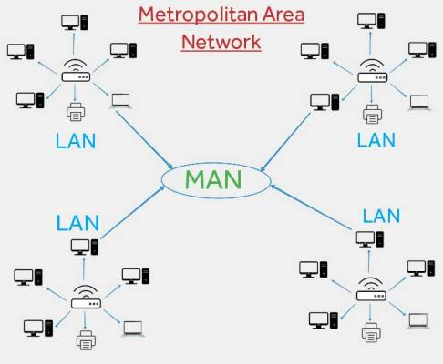

# MAN

**Introduction:**

In the realm of computer networking, Metropolitan Area Networks (MANs) serve as vital infrastructure for connecting multiple Local Area Networks (LANs) within a specific metropolitan area or city. In this blog post, we will delve into the world of MANs, exploring their characteristics, components, and significance in enabling seamless communication and data exchange within urban environments.

**Metropolitan Area Network (MAN):**

A Metropolitan Area Network, or MAN, is a network infrastructure that spans a metropolitan area, linking multiple LANs, corporate offices, educational institutions, and other entities within the region. MANs provide connectivity and facilitate data transfer over larger geographic areas than LANs, enabling efficient communication within a city or urban area.

<figure><figcaption></figcaption></figure>

**Key characteristics of a MAN:**

**1. Coverage within a city:** MANs typically cover a specific metropolitan area or city, connecting various LANs and network nodes dispersed throughout the urban landscape.

**2. High-speed connectivity:** MANs offer fast data transfer speeds, ensuring quick communication and resource sharing between different locations within the metropolitan area.

**3. Hybrid infrastructure:** MANs can utilize a combination of wired and wireless technologies, including fiber optics, Ethernet cables, and wireless connections, to establish reliable and scalable networks.

**4. Scalability and flexibility:** MANs are designed to accommodate the growing needs of urban areas, allowing for easy expansion and adaptation to new technologies and network demands.

**Components of a MAN:**

**1. Fiber Optic Cables:** MANs often rely on fiber optic cables to transmit data over long distances with high speed and reliability.

**2. Network Switches:** Switches play a crucial role in MANs by connecting multiple LANs and facilitating the flow of data between different network segments.

**3. Network Nodes:** Network nodes, such as routers and switches, serve as connection points within a MAN, enabling data transmission and routing between various LANs and network devices.

**4. Access Points:** In wireless MANs, access points provide wireless connectivity, allowing devices to connect to the network without the need for physical cables.

**Benefits of MAN:**

**1. Improved Interconnectivity:** MANs enhance communication and collaboration among businesses, educational institutions, government agencies, and other entities within a city, fostering economic growth and development.

**2. Efficient Resource Sharing:** MANs enable the sharing of resources such as servers, printers, and internet connections among different locations, optimizing resource utilization and reducing costs.

**3. Enhanced Disaster Recovery:** MANs facilitate the implementation of robust disaster recovery strategies, ensuring data backup and continuity of operations within a city, even during unforeseen events.

**4. Support for Smart City Initiatives:** MANs form a critical infrastructure for smart city projects, enabling the deployment of Internet of Things (IoT) devices, smart grids, and other connected systems to improve urban services and efficiency.

**Conclusion:**

Metropolitan Area Networks (MANs) play a crucial role in connecting LANs and facilitating seamless communication and data exchange within cities and metropolitan areas. With their extensive coverage, high-speed connectivity, and scalable infrastructure, MANs empower urban environments to thrive in the digital age, fostering collaboration, resource sharing, and the realization of smart city initiatives. Understanding the fundamentals of MANs is essential for organizations and individuals seeking to leverage the power of interconnectedness within urban landscapes.
