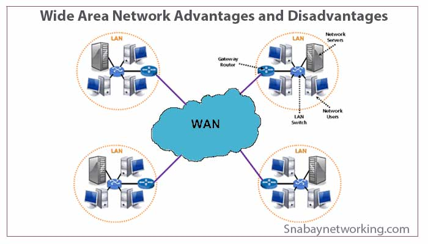

# WAN&#x20;

**Introduction:**

In the realm of computer networking, Wide Area Networks (WANs) form the backbone of global connectivity, facilitating communication and data exchange over vast distances. In this blog post, we will explore the fundamentals of WANs, their essential components, and their significance in connecting geographically dispersed locations.

**Wide Area Network (WAN):**

A Wide Area Network, or WAN, is a network infrastructure that spans a large geographical area, connecting multiple Local Area Networks (LANs) or other WANs. WANs enable communication between devices located in different cities, countries, or even continents. They are often used by organizations with branch offices, remote workers, or business partners spread across various locations.

<figure><figcaption></figcaption></figure>

### Video Resources


[Network Types Videos](http://localhost:5000/s/ZeJJu3qDetIU3qPmLSmZ/network-types-videos)


**Key characteristics of a WAN:**

**1. Extensive coverage:** Unlike LANs, which have limited coverage, WANs can span vast distances, crossing multiple cities, regions, or countries, facilitating communication on a global scale.

**2. Interconnected networks:** WANs connect multiple LANs or smaller networks, enabling seamless data transmission and resource sharing between different locations.

**3. Public or private infrastructure:** WANs can be built using public infrastructure, such as the Internet, or private dedicated connections, such as leased lines or Virtual Private Networks (VPNs).

**4. Network protocols:** WANs employ various protocols, such as the Internet Protocol (IP), to route data packets efficiently across different networks, ensuring reliable and secure transmission.

**Components of a WAN:**

**1. Routers:** Routers play a vital role in WANs by directing data packets between networks. They analyze destination addresses and determine the most efficient path for data transmission.

**2. Switches:** WAN switches facilitate the connection and communication between devices within a WAN. They help manage traffic flow and improve network efficiency.

**3. Transmission media:** WANs utilize a range of transmission media, including optical fibers, satellite links, microwave links, and leased lines, to establish connections over long distances.

**4. Service Providers:** WANs often rely on Internet Service Providers (ISPs) or telecommunication companies to provide connectivity and infrastructure for data transmission between locations.

**Benefits of WAN:**

**1. Geographical connectivity:** WANs enable seamless communication and collaboration between geographically dispersed locations, allowing organizations to operate as a unified entity.

**2. Centralized resources:** WANs provide access to centralized resources, such as databases, applications, and servers, ensuring efficient utilization and management of shared resources across locations.

**3. Enhanced productivity:** WANs empower remote workers and branch offices to connect to the main network, accessing critical information and resources, resulting in improved productivity and streamlined workflows.

**4. Data backup and disaster recovery:** WANs facilitate centralized data backup and disaster recovery strategies, ensuring the safety and availability of vital data across multiple locations.

**Conclusion:**

**Wide Area Networks (WANs)** serve as the backbone of global connectivity, connecting geographically dispersed locations and enabling seamless communication and data exchange. With their extensive coverage and advanced networking components, WANs empower organizations to operate efficiently and effectively, regardless of their physical distance. Understanding the basics of WANs is essential for businesses and individuals seeking to harness the power of interconnectedness in today's globalized world.
